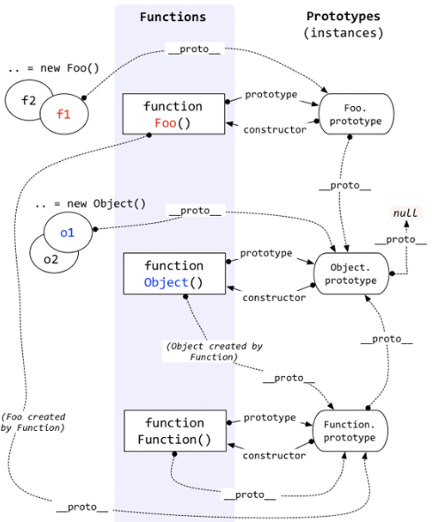

## **JavaScript系列之原型到原型链**

## **1. 开局一张图**
  
## **2. 原型prototype**
首先我们要知道JavaScript是基于原型的，每个对象都拥有一个原型对象，而每个函数也有其属性，我们称其为`原型（prototype）`,如下：
```js
function Foo() {}
console.log(Foo) // 控制台查看
```
我们试着往上面的函数的原型中加点属性看看效果
```js
function Foo(){}
Foo.prototype.name = "hsq";
console.log(Foo.prototype);
```
再接着我们试试通过new实例化对象看看效果
```js
function Foo(){}
const foo = new Foo();
Foo.prototype.name = "hsq";
foo.name = "new hsq";
console.log(Foo); // 控制台查看
console.log(Foo.prototype);// 控制台查看
console.log(Foo.prototype.constructor);// 控制台查看
console.log(foo); // 控制台查看
console.log(foo.constructor); // 控制台查看
console.log(Foo.prototype === foo.__proto__); // true
// __proto__  这个特性存在特殊性，存在性能问题，而且已经从web标准删除，推荐使用Object.getPrototypeOf()
console.log(Foo.prototype === Object.getPrototypeOf(foo)); // true
console.log(Foo === Foo.prototype.constructor); // true
console.log(foo.constructor === Foo.prototype.constructor); // true
```
将上面的代码运行后再结合原型链图示，相信能明白了吧。
## **3. 原型链**
prototype是js实现面向对象编程的核心，每个对象都拥有一个原型对象，并且通过`__proto__`指向上一个原型对象`prototype`，
而这个原型对象也有一个自己的原型对象，于是他就会一层一层的往上找，直到他指向null，因为JavaScript定义null没有原型，
而这个过程我们就称之为原型链